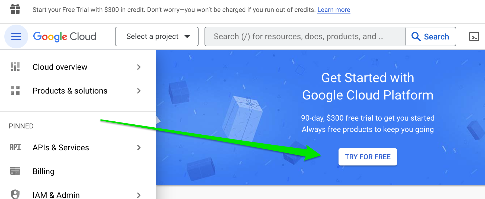

<h1 align="center">Build a Google Chat Bot Powered by ChatGPT</h1>
<h3 align="center">Developer Workshop</h3>


<br />
<br />
<br />

## Prepare for the workshop
Complete these tasks so you're ready when the workshop begins:

### 1. Sign in to your ChatGPT account

1. [Sign in to your OpenAI account](https://platform.openai.com/account) and check if you have any free trial credits in the [Usage](https://platform.openai.com/account/usage) section of your account.

2. If you don't have free trial credits, [set up a paid account](https://platform.openai.com/account/billing/overview) by entering a payment method.

    > **OpenAI Costs**<br/>
    > There are costs associated with using the OpenAI API, but they will be very minimal for our workshop.
    > 
    > OpenAI charges an account based on the number of [tokens](https://help.openai.com/en/articles/4936856-what-are-tokens-and-how-to-count-them) processed by the API. A token is approximately 4 characters. [Pricing](https://openai.com/pricing) varies depending on what model is used in the API. We will be using `gpt-3.5-turbo` for our API calls, with a price of $0.002 per 1,000 tokens.
    > 
    > To put this in more usable terms, you can expect to pay:
    > 
    > **1 cent for about 15 pages of text (3,750 words)**

<br />
<br />

### 2. Sign in to Google Cloud
1. [Sign in to Google Cloud Console](https://console.cloud.google.com/) with your name@colorado.edu Google Workspace account.

    > **NOTE:** It's important you do **NOT** sign in with a regular ```@gmail.com``` address, because Chat bots are not allowed for those accounts.

2. Sign up for free trial credits if they are available:

    

    Otherwise, [set up billing](https://console.cloud.google.com/billing) by entering a payment method.

    > **Google Cloud Costs** <br/>
    > Most Google Cloud products have a free tier where you can use them up to a certain quota at no cost. Our usage will be well within the free quota, but Google still requires you to enter a payment method in case you ever go over the quota.


<br />
That's it!
<br />
<br />

## [Go to the workshop overview](README.md#build-a-google-chat-bot-powered-by-chatgpt)
