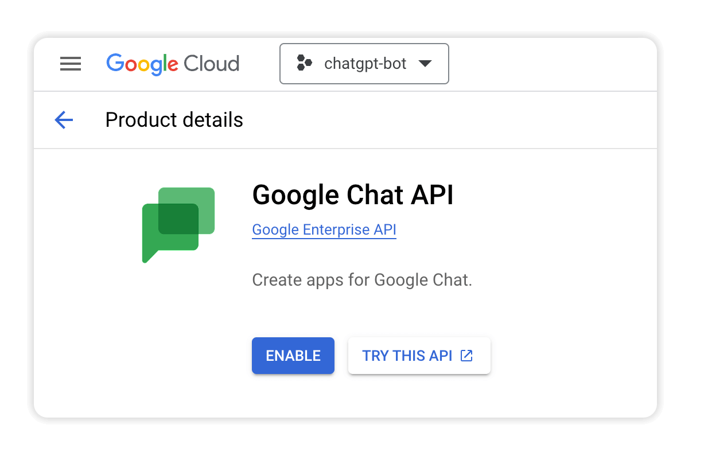

# Module 1 - Build a Basic Chat Bot

In this module you'll build a basic bot for Google Chat that repeats back whatever message is received from a user. 

## Prerequisites

1. Google Workspace.
2. [Google Cloud account](https://console.cloud.google.com/), with billing enabled, or free trial.
3. Experience with Python.


## Steps

### 1. Create a Google Cloud project
Create a new project in your [Google Cloud Console](https://console.cloud.google.com/)


Name the project `chatgpt-bot` and click **CREATE**.


### 2. Create a Google Cloud Function
Select your new project as the active project and create a new function in [Google Cloud Functions](https://console.cloud.google.com/functions/list) by clicking the **CREATE FUNCTION** button.


When prompted, enable the required APIs by clicking **ENABLE**.


### 3. Configure the Cloud Function
Complete the configuration as shown below and click **SAVE**.


### 4. Choose the runtime
Click **NEXT** and then choose *Python 3.11* as the Runtime for the function.


### 5. Set the Entry point
Set the "Entry point" to `handle_chat`.


> When the URL endpoint for this function is triggered, the function name listed as the "Entry point" will be run.


### 6. Update `main.py`

Replace the default code in `main.py` with the following code, which replies to the user when the bot is added to a space, or sent a message:

```python
import flask
import functions_framework
import logging
import google.cloud.logging

logging_client = google.cloud.logging.Client()
logging_client.setup_logging(log_level=logging.INFO)

@functions_framework.http
def handle_chat(request):
    """Handles incoming messages from Google Chat."""
    event_data = request.get_json()
    logging.info("received event_data %s" % event_data)
    event_type = event_data['type']

    # Bot added
    if event_type == 'ADDED_TO_SPACE':
        
        # Added to a room
        if event_data['space']['type'] == 'ROOM':
            return { "text" : f"Thanks for adding me to the room. "\
                    "Mention me in a conversation whenever you need help." }

        # Added to a DM
        elif event_data['space']['type'] == 'DM':
            user_display_name = event_data['user']['displayName']
            return { "text" : f"Hi {user_display_name}! I'm here to help "\
                     "whenever you need it."}

    # Bot removed
    elif event_type == 'REMOVED_FROM_SPACE':
        return {}

    # A normal message event
    elif event_type == 'MESSAGE':
        return process_message_event(event_data)


def process_message_event(event_data):
    """Processes message event."""

    incoming_message = event_data.get('message', {})
    user_text = incoming_message.get('argumentText', "")

    return {"text" : f"You said: {user_text}"}

```


> The bot sends a JSON object of data to the Cloud Function for every event that occurs.
>
> View example JSON for the [ADDED_TO_SPACE event](ADDED_TO_SPACE_event.md) and [MESSAGE event](MESSAGE_event.md).


### 7. Update `requirements.txt`
Open `requirements.txt` in the editor and add the lines below to specify the dependencies for the function.

```python
functions-framework==3.*
google-cloud-logging==3.0.0
```


### 8. Deploy the function
Click **DEPLOY** to push the function live.


### 8. Enable the Google Chat API
While the Function is deploying, in a new browser tab open the [Google Chat API](https://console.cloud.google.com/apis/library/chat.googleapis.com) for your project and click **ENABLE**.



### 9. Configure the Chat app
Once the API is enabled, click on the [Configuration](https://console.cloud.google.com/apis/api/chat.googleapis.com/hangouts-chat) tab.

#### In the **Application info** section enter:
    
- App name: `ChatGPT Bot`
- Avatar URL: `https://developers.google.com/chat/images/quickstart-app-avatar.png`
- Description: `Bot powered by ChatGPT`


#### In the **Interactive features** section:

- Activate `Enable Interactive features`
- Check `Receive 1:1 messages`
- Check `Join spaces and group conversations`


#### In **Connection settings**:
- In a new browser tab go to the [Cloud Functions Trigger tab](https://console.cloud.google.com/functions/details/us-central1/chatgpt-bot?env=gen1&tab=trigger) and copy the Trigger URL


Go back to your browser tab for the Chat API and:
- Select `App URL`
- Paste the URL into the **App URL** field


#### In the **Visibility** section:
- Check the box to make the app available to specific people
- Enter your Google Workspace `@colorado.edu` email address.


#### In the **Logs** section:
- Check the box to Log errors to Logging


Click **SAVE** to configure the chat app.

## Test the bot

Open Gmail, click on Chat, **New chat** and type `chatgpt` and click on your bot.


The bot should send you a welcome message and repeat back anything you type.


## Next Steps
With your basic chat bot set up, you can now start making it smarter!

Continue with [Module 2](../mod_2_openai#readme) to integrate the ChatGPT API with your bot.