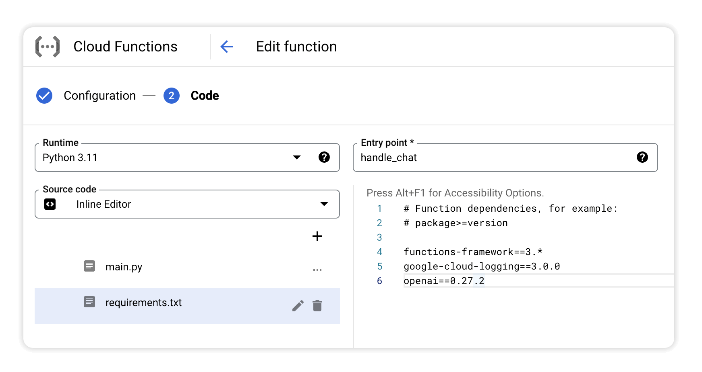
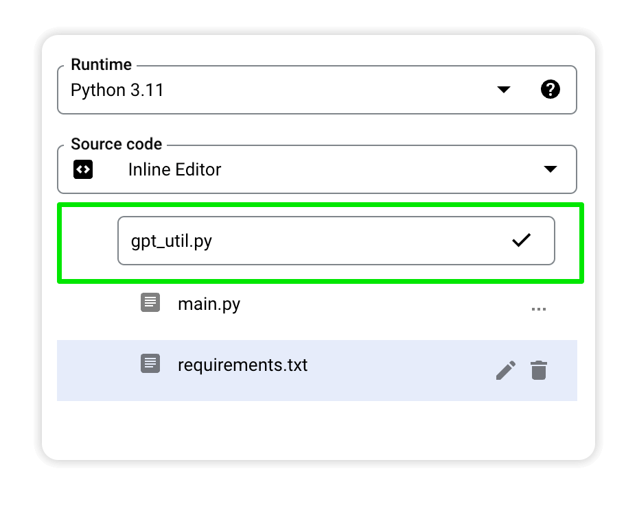
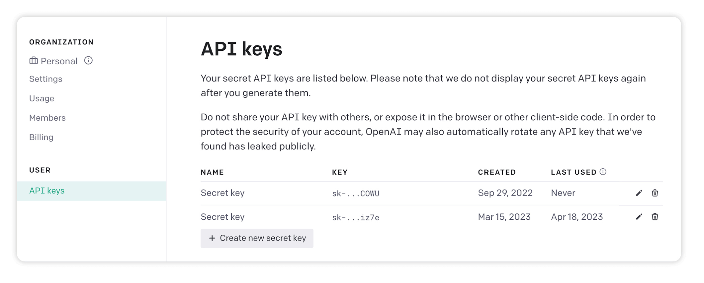
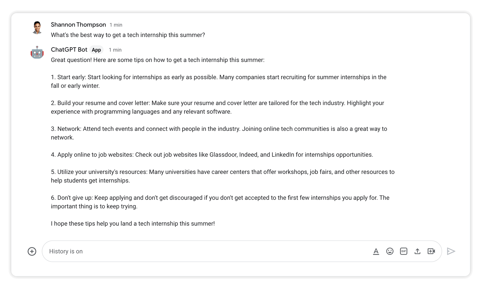
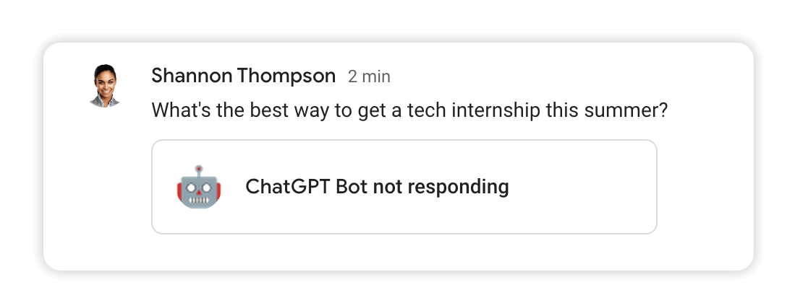
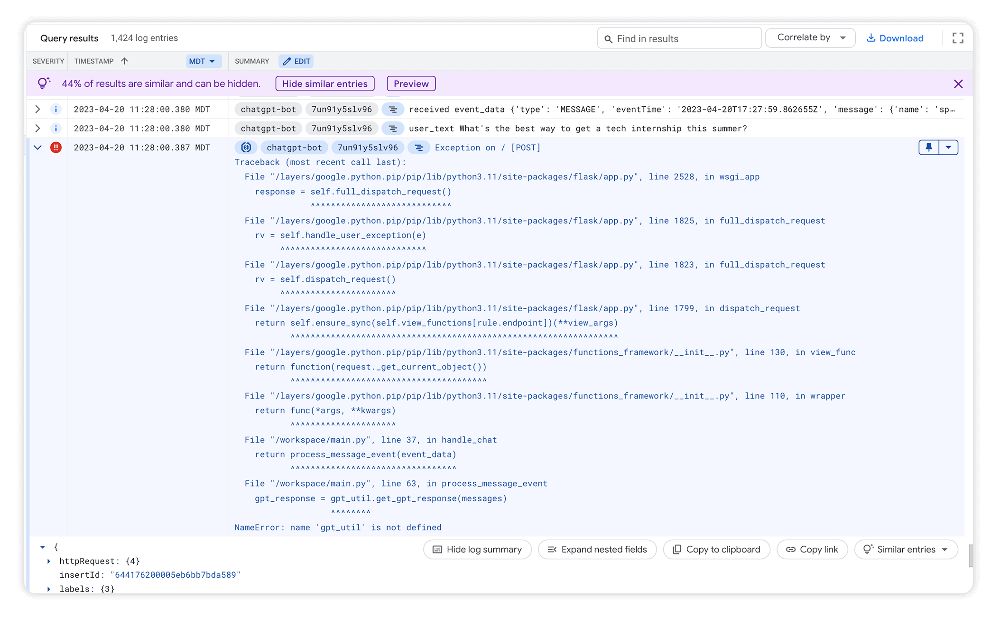

# Module 2 - Add OpenAI

This module builds on the basic chat bot by adding the OpenAI Python library and using it to process an incoming message with ChatGPT and return a response to the user.

## Prerequisites

You can either complete the steps in [Module 1](../mod_1_chat#readme) or use the source code from the [Module 1 repo folder](../mod_1_chat) as a starting point for completing the steps in this module.

## Steps

### 1. Open the Cloud Functions editor
Edit the Cloud Function by [opening the editor](https://console.cloud.google.com/functions/edit/us-central1/chatgpt-bot?env=gen1) and clicking **NEXT**.

### 2. Add the OpenAI Python library
Open the `requirements.txt` file in the editor. 



Add `openai` as a dependency to ensure the library is packaged in your Google Cloud Function and it's accessible in your code.

```python
# Function dependencies, for example:
# package>=version

functions-framework==3.*
google-cloud-logging==3.0.0
openai==0.27.2 # <-- add this line
```

### 3. Create a new file called `gpt_util.py`
Create a new file in the left panel of the editor called `gpt_util.py`.



Add the following code to the file, which will process messages using ChatGPT. You can read more about the ChatGPT API in the [docs here](https://platform.openai.com/docs/api-reference/chat/create).

```python
import openai

def get_gpt_response(messages):
    """Processes messages using ChatGPT.
    
    Returns: a response from ChatGPT.

    Raises: openai.error.OpenAIError

    API Details here: https://platform.openai.com/docs/api-reference/chat/create 
    """

    completion = openai.ChatCompletion.create(
        model="gpt-3.5-turbo",
        temperature=1.1,
        messages=messages
    )

    gpt_response = completion['choices'][0]['message']['content']

    return gpt_response
```

### 4. Update main.py

Import `openai` and `gpt_util` at the top of `main.py` so you can use them in this file.

```python
import flask
import functions_framework
import logging
import google.cloud.logging
import openai # <-- add this line
import gpt_util # <-- add this line

# TODO: put in your own OpenAI API key
MY_API_KEY = "sk-xxxxxxxxxxxxxxxxxxx" # <-- add this line
```

Also add a variable to store your OpenAI API key as shown above.

Replace the placeholder text with your own API key which can be found in your [API Keys section](https://platform.openai.com/account/api-keys) of your OpenAI account.



Now, instead of repeating back what the user said, update the bot to process the incoming message with the OpenAI API and return the response to the user.

To accomplish this, update `process_message_event()` with the following code:

```python
def process_message_event(event_data):
    """Processes message event."""

    incoming_message = event_data.get('message', {})
    user_text = incoming_message.get('argumentText', "")
    user_name = event_data['user']['name']

    logging.info("user_text %s" % user_text)
    
    openai.api_key = MY_API_KEY

    messages = []

    # set guidance for ChatGPT
    guidance = "You are helpful assistant who has a cheerful attitude"
    messages.append({"role": "system", "content" : guidance})

    # add new message to list
    messages.append( {"role": "user", "content": user_text} )

    # get new gpt response
    try:
        gpt_response = gpt_util.get_gpt_response(messages)
    except openai.error.OpenAIError as e:
        return { "text" : str(e)}

    chat_response = { 
        "text" : gpt_response
    }

    logging.info("chat_response: %s" % chat_response)

    return chat_response
```

### 5. Deploy the changes
Click **DEPLOY** to set your changes live.


## Test the bot
After the new version of your function is deployed, go back to your chat bot in Gmail and type a message to ask ChatGPT for help with something. You should get a response just like using ChatGPT in the browser!



## Troubleshooting
If your bot doesn't respond there is most likely an error somewhere.



You can track down the issue by using the [Logs Explorer](https://console.cloud.google.com/logs/query) to view any errors.




Fix any issues and re-deploy the function.

## Next Steps
Your bot can now process an incoming message and respond using ChatGPT. Since your OpenAI account is being charged for all processing you'll want to ensure incoming requests are verified messages from your bot and not some malware or other bad actor.

Continue with [Module 3](../mod_3_verify#readme) to verify a request to your Cloud Function before processing its message.
