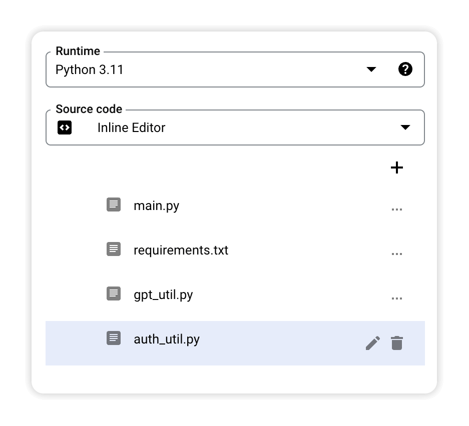
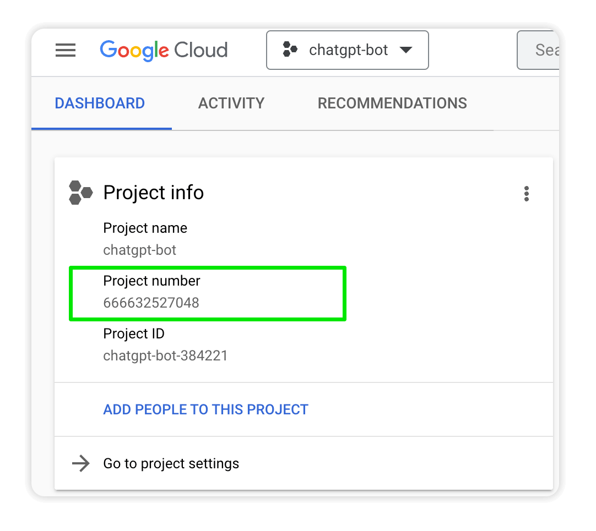
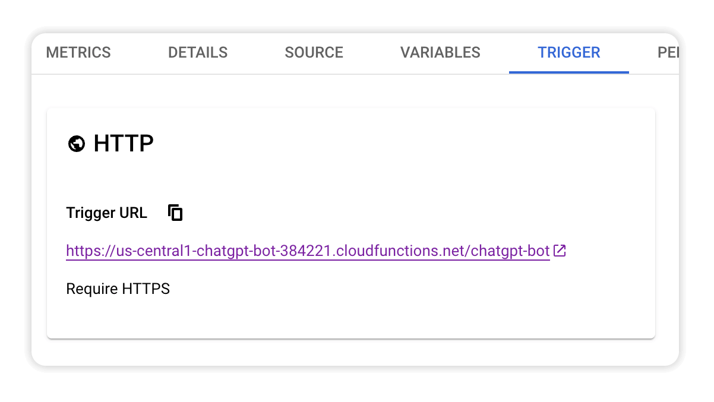
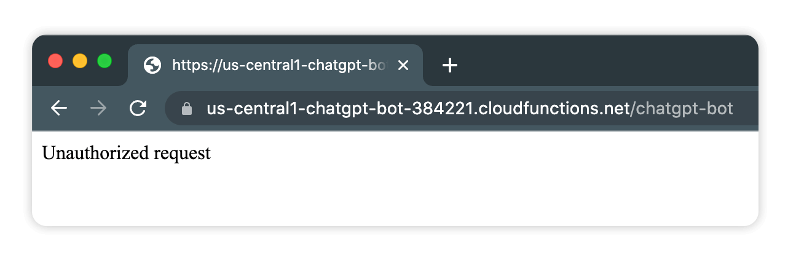

# Module 3 - Verify Requests
At this point the Google Cloud Function will respond to any GET or POST request that is sent to the Trigger URL, which means the incoming data can't be trusted.

This module builds on Module 1 by verifying a request actually comes from the Google Workspace bot and not a random person triggering the Cloud Functions URL.

## Prerequisites

You can either complete the steps in [Module 2](../mod_2_openai#readme) or use the source code from the [Module 2 repo folder](../mod_2_openai) as a starting point for completing the steps in this module.

## Steps

### 1. Add the oauth2client library
Open the `requirements.txt` file and add oauth2client as a dependency so you can use this library in code. 

```python
# Function dependencies, for example:
# package>=version

functions-framework==3.*
google-cloud-logging==3.0.0
openai==0.27.2
oauth2client==4.1.3 # <-- add this line
```

### 2. Create a new file called `auth_util.py`
Create a new file in the editor called `auth_util.py`.



Add the following code to the file, which is based on [this Google Chat documentation](https://developers.google.com/chat/api/guides/message-formats#verify_app_authenticity):

```python
import logging

from oauth2client import client

# Bearer Tokens received by apps will always specify this issuer.
CHAT_ISSUER = 'chat@system.gserviceaccount.com'

# Url to obtain the public certificate for the issuer.
PUBLIC_CERT_URL_PREFIX = 'https://www.googleapis.com/service_accounts/v1/metadata/x509/'

# Intended audience of the token, which will be the project number of the app.
# TODO: Update audience with project number
AUDIENCE = 'XXXXXXXXXXXX'

def is_request_valid(request):
    """Verify the validity of a bearer token received by an app, using OAuth2Client.

    Args:
        request: The request object containing the Authorization header with the bearer token.

    Returns:
        True if the bearer token is valid and intended for the app, False otherwise.
        
    Raises:
        Exception: If the Authorization header is missing.
    """

    try:
        # Get the token from the Authorization header
        auth_header = request.headers.get('Authorization')
        if not auth_header:
            raise Exception('Authorization header is missing')
        
        token = auth_header.split(' ')[1]

        # Verify valid token, signed by CHAT_ISSUER, intended for a third party.
        token = client.verify_id_token(token, AUDIENCE, cert_uri=PUBLIC_CERT_URL_PREFIX + CHAT_ISSUER)

        logging.info("verified token: %s" % token)

        if token['iss'] != CHAT_ISSUER:
            return False
    except:
        return False
    
    return True
```

### 3. Update `AUDIENCE` in `auth_util.py`
The bearer token sent with each request specifies the target app for the message. The `verify_id_token()` function will check that the audience of the token matches your project number.

Copy your project number from the [Google Cloud Dashboard](https://console.cloud.google.com/home/dashboard)



Replace the AUDIENCE placeholder with your project number.

```python
AUDIENCE = '666632527048'
```

### 4. Update `main.py`
Import the `is_request_valid` function at the top of `main.py` so you can use it in this file.

```python
import flask
import functions_framework
import logging
import google.cloud.logging
import openai
import gpt_util
from auth_util import is_request_valid  # <-- add this line
```

Add this code to the beginning of `handle_chat()` so the request is verified before any processing happens.

```python
@functions_framework.http
def handle_chat(request):
    """Handles incoming messages from Google Chat."""

    # verify request is from Google before doing anything
    if not is_request_valid(request):
        return "Unauthorized request"

    ...
```

### 5. Deploy the changes
Click **DEPLOY** to set your changes live.


## Test unauthorized requests
Copy the Trigger URL for your Cloud Function and open it in a browser tab.



Verify you now see an "Unauthorized" message.



## Next Steps
With requests now being verified before processing, you know you can trust any incoming data. Next you'll give your bot a memory so it can respond to a message using the full context of your conversation!

Continue with [Module 4](../mod_4_datastore#readme) to add Cloud Datastore to your bot.