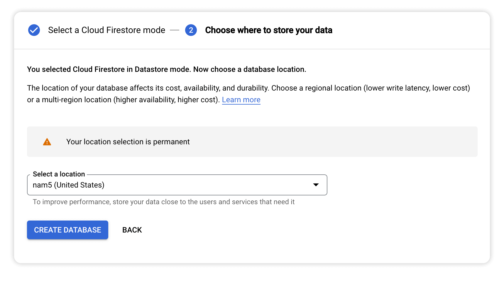

# Module 4 - Add Datastore
Right now the bot responds to an individual message using the ChatGPT API, but it doesn't have any context of previous messages in the conversation. In this module you'll set up a datastore to track the history of messages so you can provide them to ChatGPT along with the new message.

## Prerequisites
You can either complete the steps in [Module 3](../mod_3_verify#readme) or use the source code from the [Module 3 repo folder](../mod_3_verify) as a starting point for completing the steps in this module.

## Steps

### 1. Create a datastore
Set up a datastore for your Google Cloud project by going to the [Datastore service](https://console.cloud.google.com/datastore/welcome) and clicking **SELECT DATASTORE MODE**. 


Select "nam5" as the datastore location and click **CREATE DATABASE**.



### 2. Add the ndb client library
Open the `requirements.txt` file and add `google-cloud-ndb` as a dependency so you can use this library in code. 

```python
# Function dependencies, for example:
# package>=version

functions-framework==3.*
google-cloud-logging==3.0.0
openai==0.27.2
oauth2client==4.1.3
google-cloud-ndb==2.1.1 # <-- add this line
```

### 3. Create a datastore model
Create a new file called `models.py` and add the following code to define a Thread entity in the datastore:

```python
from google.cloud import ndb

class Thread(ndb.Model):
    message_history = ndb.JsonProperty()
    timestamp = ndb.DateTimeProperty(auto_now_add=True)

    def get_messages(self):
        return self.message_history['messages']
```

### 4. Create a new file called `datastore_util.py`
Create a new file called `datastore_util.py` with the following code that stores messages and retrieves Thread entities:

```python
import logging

from google.cloud import ndb
from models import *

datastore_client = ndb.Client()

def store_messages(thread_id, messages=[]):
    """Stores a list of messages for the thread_id.

    Uses get_or_insert() to ensure only one Thread entity exists per thread_id.
    """

    if not thread_id:
        return

    with datastore_client.context():
        thread = Thread.get_or_insert(thread_id)
        thread.message_history = { "messages" : messages }
        thread.put()

def get_thread(thread_id):
    """Returns thread_obj for thread_id."""

    if not thread_id:
        return None

    with datastore_client.context():
        thread_obj = Thread.get_by_id(thread_id)
        return thread_obj

```

### 3. Update `main.py`
Import `datastore_util` at the top of `main.py` so you can use it in this file.

```python
import flask
import functions_framework
import logging
import google.cloud.logging
import openai
import gpt_util
from auth_util import is_request_valid
import datastore_util # <-- add this line
```

Update `process_message_event()` to use the following code.

```python
def process_message_event(event_data):
    """Processes message event."""

    incoming_message = event_data.get('message', {})
    user_text = incoming_message.get('argumentText', "")
    user_name = event_data['user']['name']
    user_id = user_name.split("/")[1]
    space_name = event_data['space']['name'].split("/")[1]
    space_type = event_data['space']['spaceType']

    # if this is a direct message to the bot, create our own thread_id
    # so we can store the history of messages
    thread_id = None
    if space_type == "DIRECT_MESSAGE":
        thread_id = "%s-%s" % (user_id, space_name)

    logging.info("user_text %s" % user_text)
    logging.info("thread_id: %s" % thread_id)
    
    openai.api_key = MY_API_KEY

    messages = []

    # get previous messages to continue conversation
    thread_obj = datastore_util.get_thread(thread_id)
    if thread_obj:
        messages = thread_obj.get_messages()
    else:
        # set guidance for ChatGPT
        guidance = "You are helpful assistant who has a cheerful attitude"
        messages.append({"role": "system", "content" : guidance})

    # add new message to list
    messages.append( {"role": "user", "content": user_text} )

    # get new gpt response
    try:
        gpt_response = gpt_util.get_gpt_response(messages)
    except openai.error.OpenAIError as e:
        return { "text" : str(e)}

    # add new response to message history and store it
    if thread_id:
        messages.append( {"role": "assistant", "content": gpt_response} )
        datastore_util.store_messages(thread_id, messages)

    chat_response = { 
        "text" : gpt_response
    }

    logging.info("chat_response: %s" % chat_response)

    return chat_response
```

### 5. Deploy the changes
Click **DEPLOY** to set your changes live.


## Test the bot
Ask your bot follow-up questions to verify it replies using context from previous messages.


You can also [view the Datastore](https://console.cloud.google.com/datastore/entities) to see the entity created for your conversation.


## Next Steps
The bot has now achieved parity with the regular ChatGPT experience in a browser. Next you'll add various commands to your bot to control its personality and the types of responses it gives!

Continue with [Module 5](../mod_5_commands#readme) to add "slash commands" to your bot.

