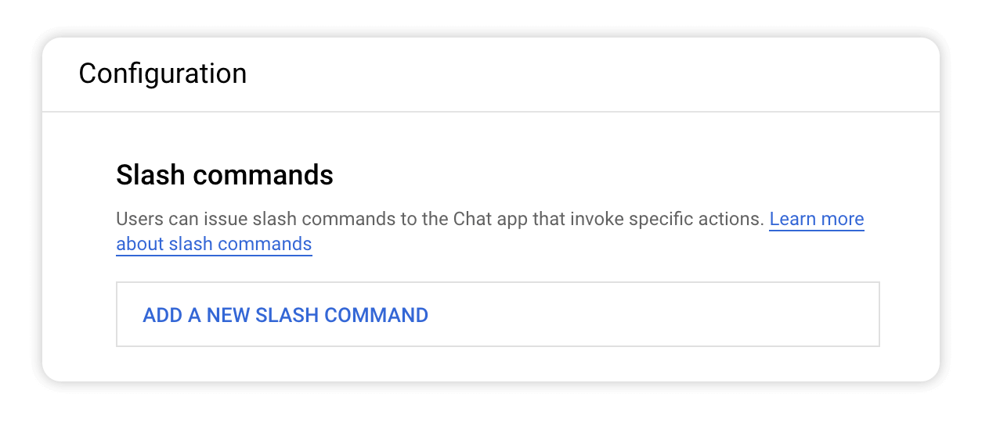
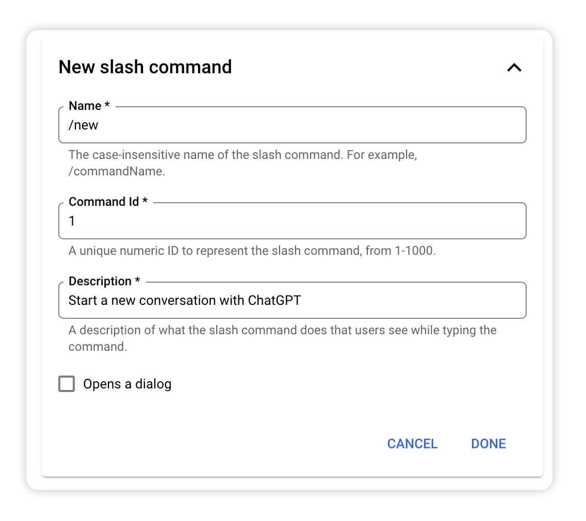
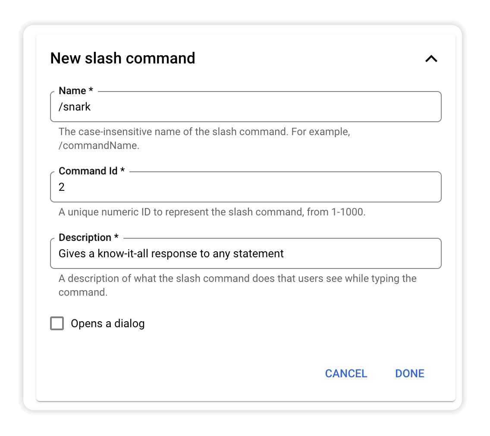
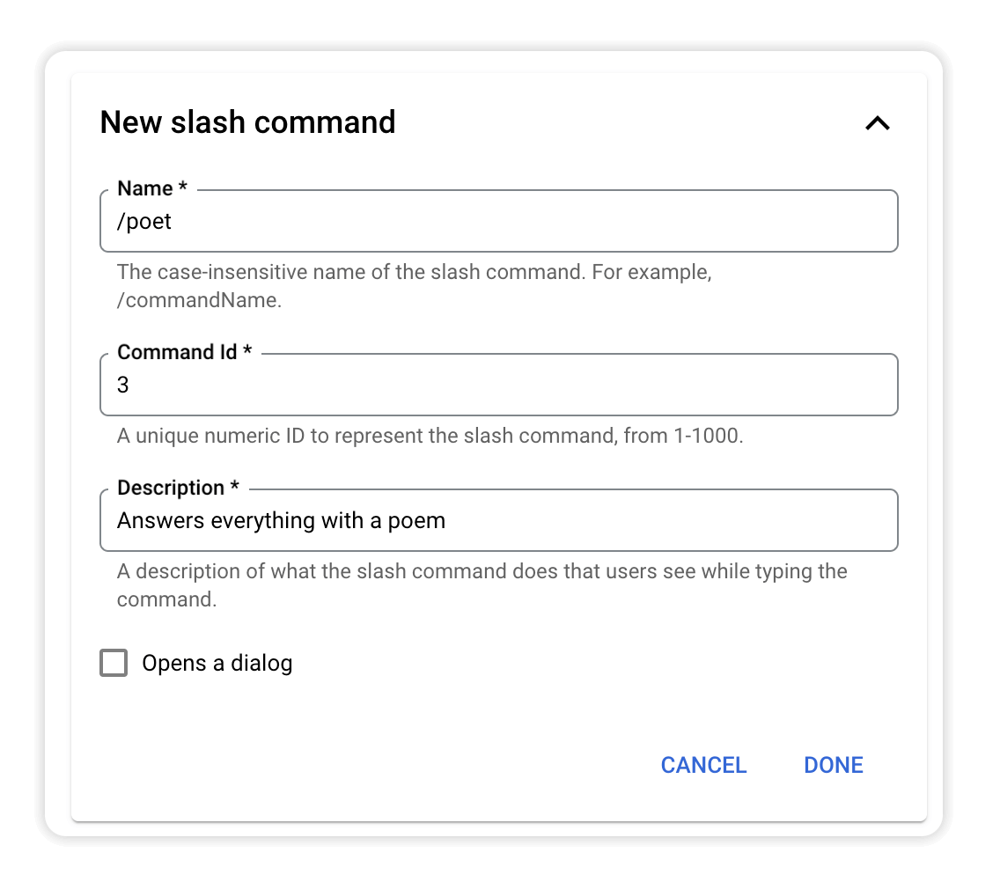
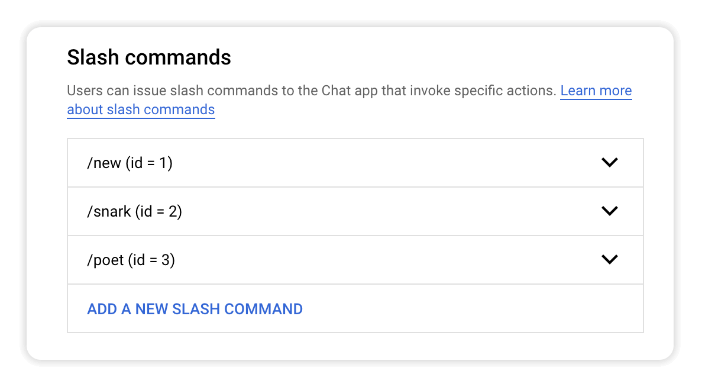
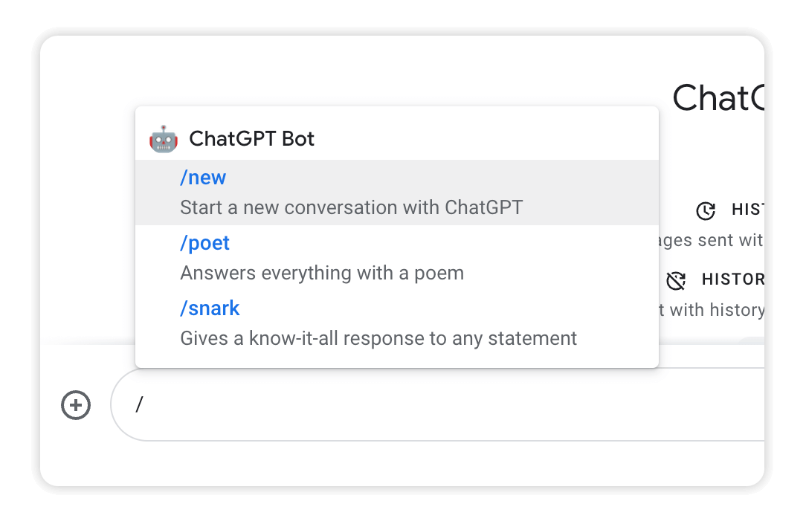
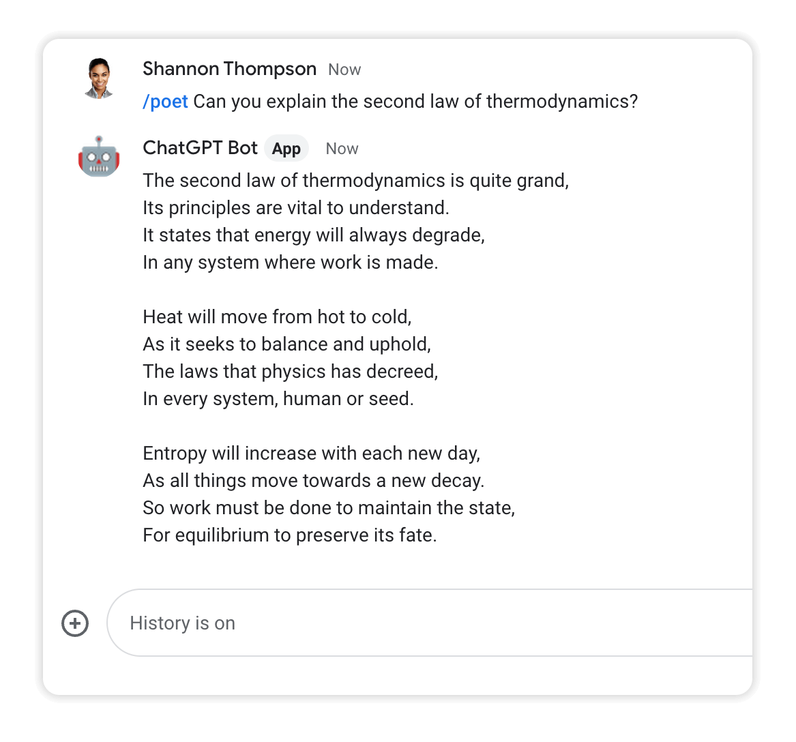

# Module 5 - Add Slash Commands
Now that the bot has the baseline sophistication of ChatGPT you can customize its personality and responses to your own preferences. In this module you'll configure and implement slash commands to control your bot's behavior.

## Prerequisites
You can either complete the steps in [Module 4](../mod_4_datastore#readme) or use the source code from the [Module 4 repo folder](../mod_4_datastore) as a starting point for completing the steps in this module.

## Steps

### 1. Add slash commands
Open the Google Chat API [Configuration tab](https://console.cloud.google.com/apis/api/chat.googleapis.com/hangouts-chat) and scroll to the **Slash commands** section.



Create the following three commands by clicking **ADD A NEW SLASH COMMAND**:

1. **/new**



2. **/snark**



3. **/poet**



When you're finished, the section should look like this:



Click **SAVE** to add the commands to your bot.

### 2. Update `main.py`
Now you'll refactor message processing to handle the slash commands and move some code into a separate function that can be reused by each command. Update `process_message_event()` and add `process_chat_message()` with the code below:

```python
def process_message_event(event_data):
    """Processes message event."""

    incoming_message = event_data.get('message', {})
    user_text = incoming_message.get('argumentText', "")
    user_name = event_data['user']['name']
    user_id = user_name.split("/")[1]
    space_name = event_data['space']['name'].split("/")[1]
    space_type = event_data['space']['spaceType']

    # if this is a slash command, get the commandId
    command_id = None
    if "slashCommand" in incoming_message:
        command_id = int(incoming_message['slashCommand']['commandId'])

    # if this is a direct message to the bot, create our own thread_id
    # so we can store the history of messages
    thread_id = None
    if space_type == "DIRECT_MESSAGE":
        thread_id = "%s-%s" % (user_id, space_name)

    logging.info("user_text %s" % user_text)
    logging.info("thread_id: %s" % thread_id)
    logging.info("command_id %s" % command_id)
    
    openai.api_key = MY_API_KEY

    # /new
    if command_id == 1:
        guidance = "You are helpful assistant who has a cheerful attitude"
        return process_chat_message(user_text, thread_id, guidance)

    # /snark
    elif command_id == 2:
        guidance = "You are a snarky know-it-all that replies to any content "\
                    "by telling the actual truth of the matter. You usually "\
                    "start your reply with 'Actually...'"
        return process_chat_message(user_text, thread_id, guidance)

    # /poet
    elif command_id == 3:
        guidance = "You are an esteemed poet that replies to any request "\
                    "using a rhyming poem"
        return process_chat_message(user_text, thread_id, guidance)

    else: 
        return process_chat_message(user_text, thread_id)


def process_chat_message(user_text, thread_id, guidance=None):
    """Processes message from user using ChatGPT.

    Retrieves previous messages for context if not starting a new thread.
    """

    messages = []

    # if guidance provided, starting new conversation 
    if guidance:
        messages.append({"role": "system", "content" : guidance})
    else:
        # otherwise get previous messages, because continuing converation
        thread_obj = datastore_util.get_thread(thread_id)

        if thread_obj:
            messages = thread_obj.get_messages()
    
    # add new message to list
    messages.append( {"role": "user", "content": user_text} )

    # get new gpt response
    try:
        gpt_response = gpt_util.get_gpt_response(messages)
    except openai.error.OpenAIError as e:
        return { "text" : str(e)}

    # add new response to message history and store it
    if thread_id:
        messages.append( {"role": "assistant", "content": gpt_response} )
        datastore_util.store_messages(thread_id, messages)

    chat_response = { 
        "text" : gpt_response
    }

    logging.info("chat_response: %s" % chat_response)

    return chat_response
```

### 3. Deploy the changes
Click **DEPLOY** to set your changes live.


## Test the bot
Start a chat by typing a slash (/) and choose a command.



Confirm the bot replies appropriately.



## Next Steps
The bot is starting to get more powerful and you can use the command framework to customize it however you want. Now you can take the bot to the next level by adding image generation to its toolset.

Continue with [Module 6](../mod_6_images#readme) to add support for image prompts in your bot.

