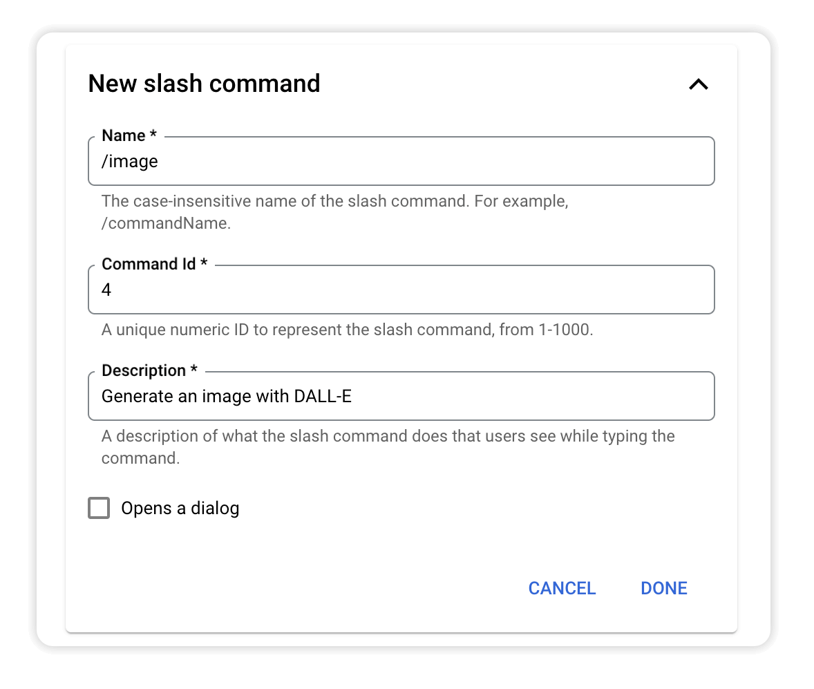
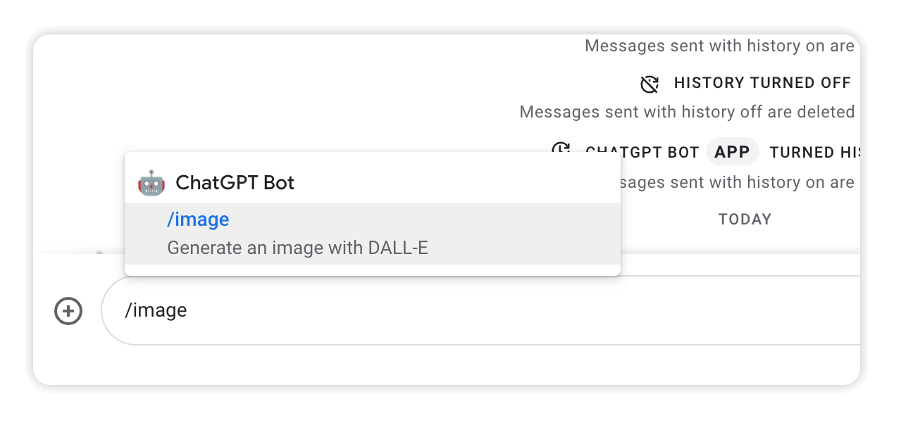
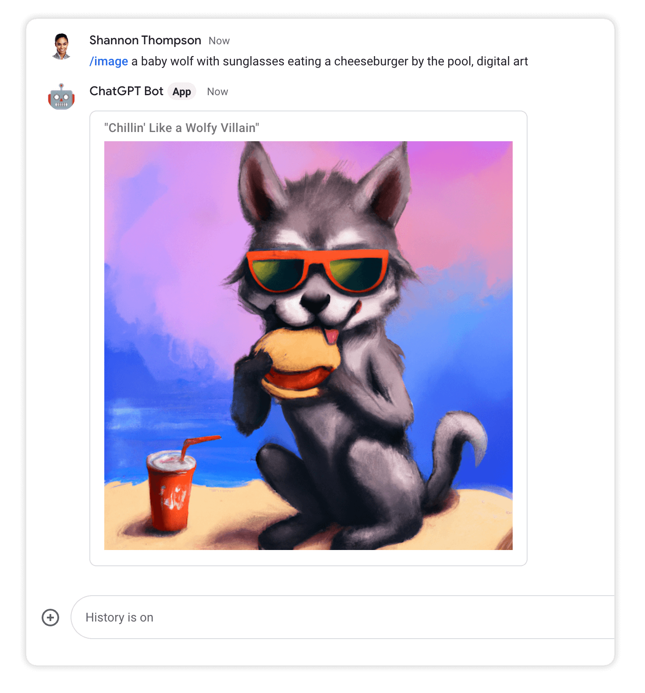

# Module 6 - Add Image Support
Can you really call it an AI-powered bot if it can't generate images on the fly based on your whims? In this module you'll add support for image generation using OpenAI's DALL·E 2 system.

## Prerequisites
You can either complete the steps in [Module 5](../mod_5_commands#readme) or use the source code from the [Module 5 repo folder](../mod_5_commands) as a starting point for completing the steps in this module.

## Steps

### 1. Add another slash command
Open the Google Chat API [Configuration tab](https://console.cloud.google.com/apis/api/chat.googleapis.com/hangouts-chat) and scroll to the **Slash commands** section.

Create a new `/image` command by clicking **ADD A NEW SLASH COMMAND**:



Click **DONE** and **SAVE** to apply your changes.

### 2. Update `gpt_util.py`
Add a new `create_image_with_prompt()` function to to `gpt_util.py` that uses the [Images API](https://platform.openai.com/docs/api-reference/images).

```python
def create_image_with_prompt(image_prompt):
    """Generates an image using DALL-E.
    
    Returns: url of new image.

    Raises: openai.error.OpenAIError

    API Details here: https://platform.openai.com/docs/api-reference/images
    """

    response = openai.Image.create(
        prompt=image_prompt,
        n=1,
        size="1024x1024"
    )

    image_url = response['data'][0]['url']
    return image_url
```

### 2. Update `main.py`
Import `random` and `string` the top of `main.py` so you can use them in this file.

```python
import flask
import functions_framework
import logging
import google.cloud.logging
import openai
from auth_util import is_request_valid
import gpt_util
import datastore_util
import random # <-- add this line
import string # <-- add this line
```

Add a new `elif` statement to `process_message_event()` to route the image command.

```python
def process_message_event(event_data):
    """Processes message event."""

    ...

    # /poet
    elif command_id == 3:
        guidance = "You are an esteemed poet that replies to any request "\
                    "using a rhyming poem"
        return process_chat_message(user_text, thread_id, guidance)

    # >>>>>> new code below >>>>>>>>

    # /image
    elif command_id == 4:
        return handle_image_command(user_text)

    # >>>>>>> new code above >>>>>>>

    else: 
        return process_chat_message(user_text, thread_id)
```

Then add a `handle_image_command()` function to the bottom of `main.py`. This function creates an image using the prompt, generates a witty title for the image, and returns both in a nicely formatted card to display to the user.
```python
def handle_image_command(image_prompt):
    """Handles user prompt for creating an image."""

    try:
        image_url = gpt_util.create_image_with_prompt(image_prompt)
    except openai.error.OpenAIError as e:
        return { "text" : str(e)}

    title_prompt = "The following prompt was given to DALL-E to create an "\
                  "image. Please come up with a witty title for the image. "\
                  "It should be no longer than 8 words: %s" % image_prompt


    messages=[ {"role": "user", "content": title_prompt} ]
    image_title = gpt_util.get_gpt_response(messages)

    alt_text = "%s - Generated by DALL-E" % image_title
    card_id = "".join( [random.choice(string.ascii_letters + string.digits) for i in range(25)] )

    cards = {
      "cardsV2": [
        {
          "cardId": card_id,
          "card": {
            "sections": [
              {
                "header": image_title,
                "widgets": [
                  {
                    "image": {
                      "imageUrl": image_url,
                      "onClick": {
                        "openLink": {
                          "url": image_url
                        }
                      },
                      "altText": alt_text
                    }
                  }
                ]
              }
            ]
          }
        }
      ]
    }

    return cards
```

> Read the [Cards Reference](https://developers.google.com/chat/api/reference/rest/v1/cards) for more details and check out the [Card Builder](https://gw-card-builder.web.app/) to easily generate JSON for your own cards.

<br />

### 3. Deploy the changes
Click **DEPLOY** to set your changes live.


## Test the bot
Start a chat by typing `/image` and enter a prompt for an image.



Confirm the bot gives you something amazing!!



## Next Steps
The bot is so cool now that you probably want others to start using it. But you don't really want to pay for their processing on your OpenAI account, right? Next, you'll refactor the bot to use an API key provided by the user instead of your hard-coded one.

Continue with [Module 7](../mod_7_apiKey#readme) to add support for a user-provided API key.


