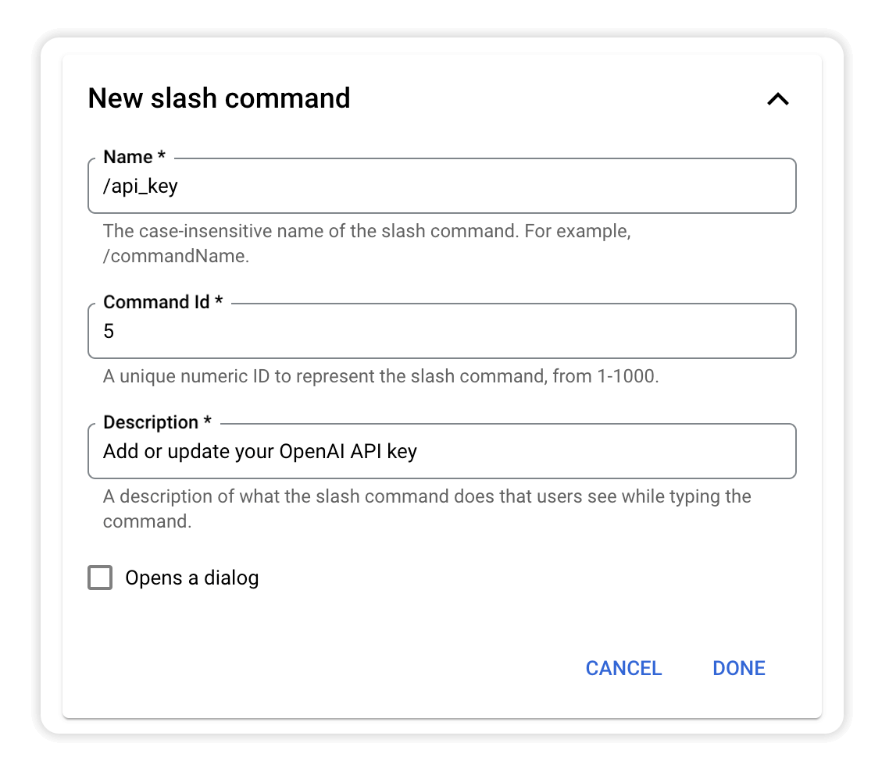
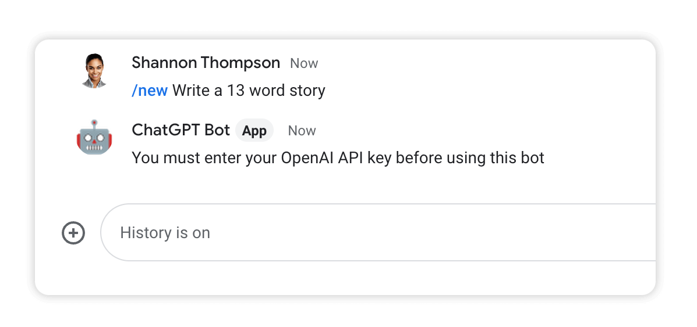
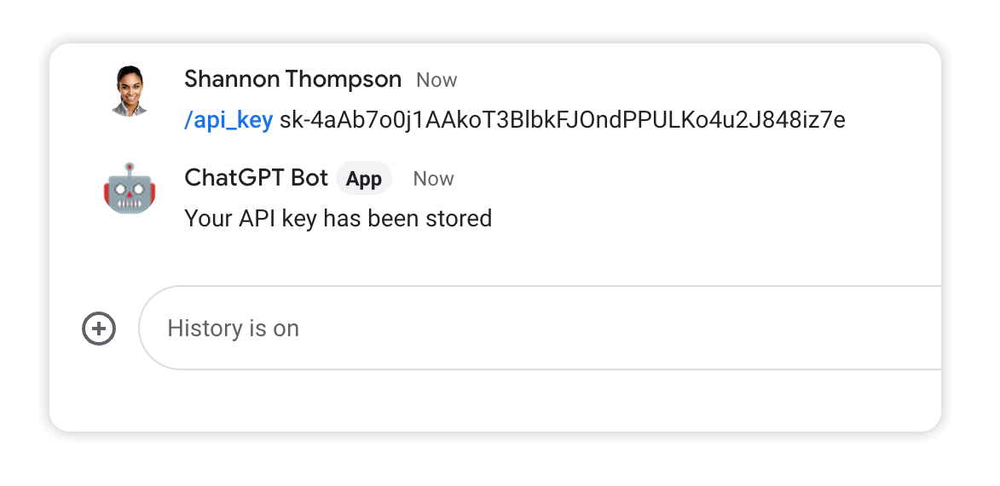
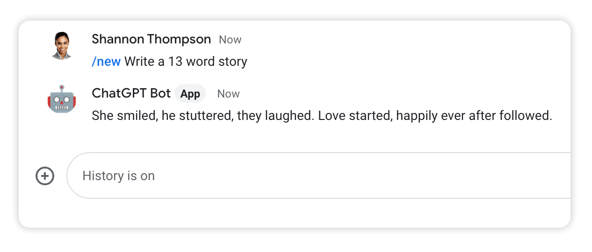
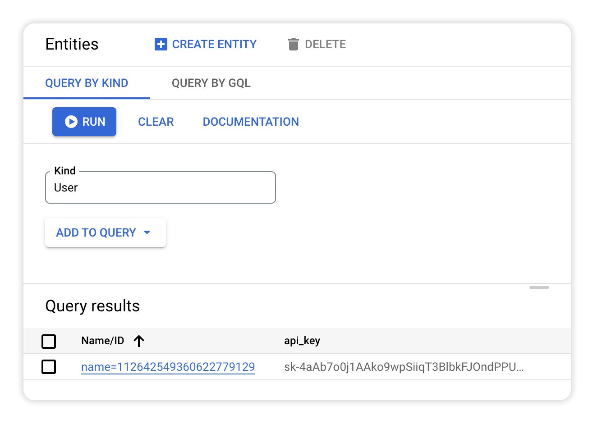

# Module 7 - Collect API Key
You may want to let others use your bot, but you probably don't want to cover their OpenAI costs. In this module you will add support for collecting an API key from the user to process their messages.

## Prerequisites
You can either complete the steps in [Module 6](../mod_6_images#readme) or use the source code from the [Module 6 repo folder](../mod_6_images) as a starting point for completing the steps in this module.

## Steps

### 1. Add another slash command
Open the Google Chat API [Configuration tab](https://console.cloud.google.com/apis/api/chat.googleapis.com/hangouts-chat) and scroll to the **Slash commands** section.

Create a new `/api_key` command by clicking **ADD A NEW SLASH COMMAND**:



Click **DONE** and **SAVE** to apply your changes.

### 2. Update `models.py`
Add a new `User` entity definition to `models.py` to store a user's API key.

```python
class User(ndb.Model):
    api_key = ndb.StringProperty()
```

### 3. Update `datastore_util.py`
Add two functions to `datastore_util.py` that will handle storing and retrieving the API key for a user.

```python
def store_api_key(user_id, api_key):
    """Stores an API key for a user.

    Uses get_or_insert() to ensure only one User entity exists per user_id.
    """

    with datastore_client.context():
        user = User.get_or_insert(user_id)
        user.api_key = api_key
        user.put()

def get_api_key(user_id):
    """Returns API key for user_id."""

    with datastore_client.context():
        user = User.get_by_id(user_id)
        if user:
            return user.api_key
        else:
            return None
```

### 4. Update `main.py`
Remove the hard-coded `MY_API_KEY` from the top of `main.py`.

> You may want to copy your key to a text file somewhere so you can paste it into the bot later.

```python
# REMOVE THE LINE BELOW
MY_API_KEY = "sk-xxxxxxxxxxxxxxxxxxx"
```

Replace the line `openai.api_key = MY_API_KEY`  in `process_message_event()` with the following code:

```python
def process_message_event(event_data):

    ...

    # /api_key
    if command_id == 5:
        datastore_util.store_api_key(user_id, user_text)
        return { "text" : "Your API key has been stored"}

    # get api_key
    api_key = datastore_util.get_api_key(user_id)
    if not api_key:
        return {"text" : "You must enter your OpenAI API key before "\
                "using this bot"}

    openai.api_key = api_key

    ...
```

<br />

### 3. Deploy the changes
Click **DEPLOY** to set your changes live.


## Test the bot
Type a message and you should be told to enter your API key.



Type `/api_key`, paste in your API key and hit enter. 



Type a new message and it should be processed using the API key you entered.



You can [view the Datastore](https://console.cloud.google.com/datastore/entities) to see your User entity and api_key.



## Next Steps
Allowing users to enter their own API key solves the billing issue. Wouldn't it be nice if the process was a little more user-friendly though, with a fancy dialog to configure the bot?

Continue with [Module 8](../mod_8_dialogs#readme) to add dialogs to your bot.


