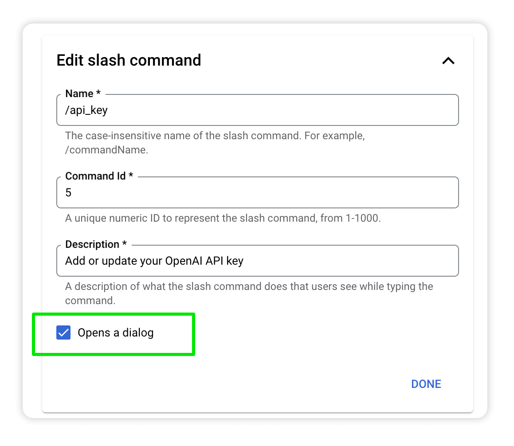
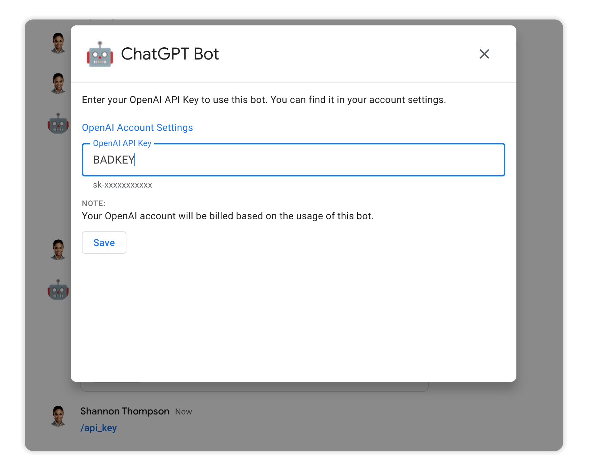
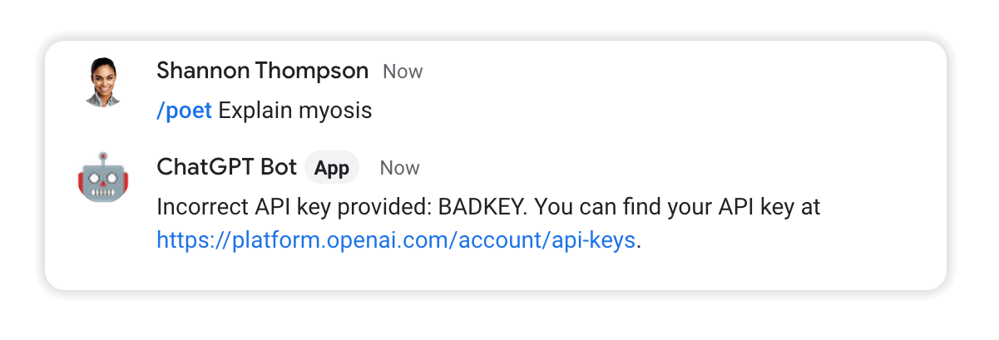
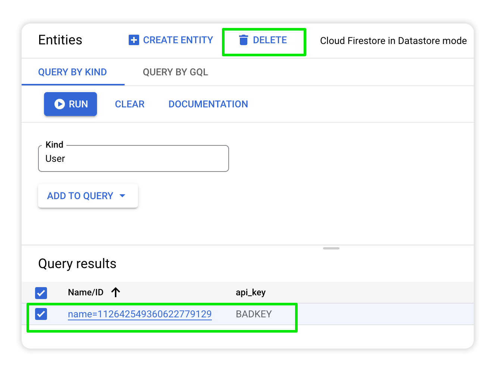
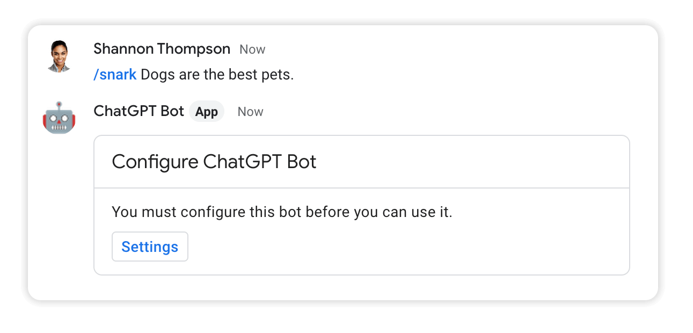
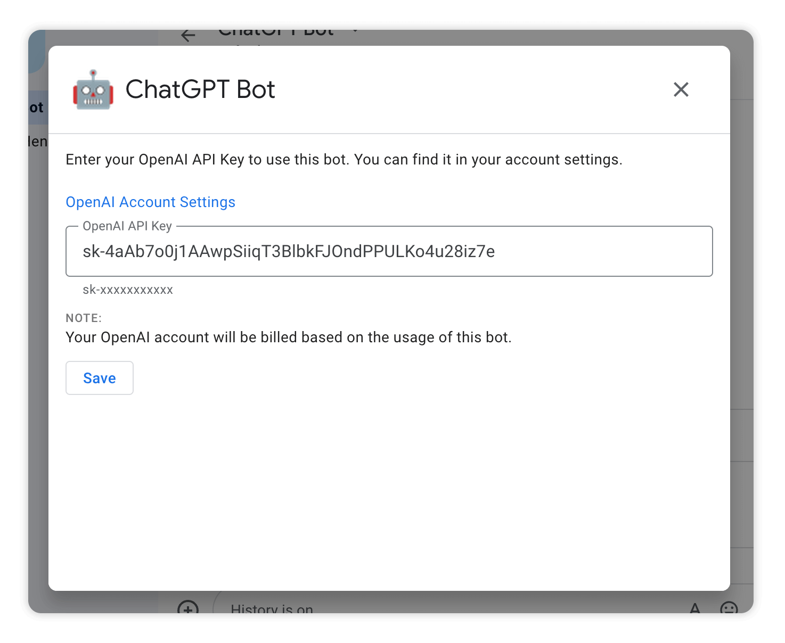
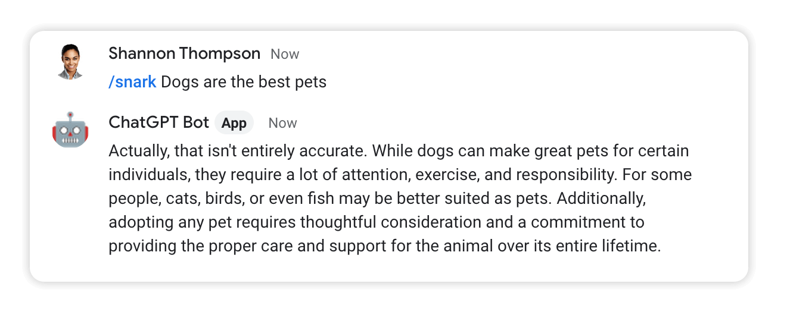

# Module 8 - Add a Dialog
Your bot is so amazing now that the set up process really deserves its own fancy interface. In this module you add a dialog to collect the user's OpenAI API key.

## Prerequisites
You can either complete the steps in [Module 7](../mod_7_apiKey#readme) or use the source code from the [Module 7 repo folder](../mod_7_apiKey) as a starting point for completing the steps in this module.

## Steps

### 1. Update the slash command
Open the Google Chat API [Configuration tab](https://console.cloud.google.com/apis/api/chat.googleapis.com/hangouts-chat) and scroll to the **Slash commands** section.

Click on the `/api_key` command to open the edit screen. Then check the **Opens a dialog** checkbox.



Click **DONE** and **SAVE** to apply your changes.

### 2. Create a new file called `dialog_util.py`
Create a new file called `dialog_util.py` with the following code that prompts the user to enter their API key in a dialog and stores it for use later.

```python
import datastore_util

def api_key_setup_card():
    """Returns card prompting user to click button ton configure bot."""

    text_widget = { 
        "decoratedText": {
            "text": "You must configure this bot before you can use it.",
            "wrapText": True
        }
    }

    button_widget = {
        "buttonList": {
            "buttons": [
                {
                    "text": "Settings",
                    "onClick": {
                        "action": {
                          "function": "get_api_key_dialog",
                          "interaction" : "OPEN_DIALOG"
                        }
                    },
                    "altText": ""
                }
            ]
        }
    }

    section = {"widgets": [text_widget, button_widget]}

    header = {"title": "Configure ChatGPT Bot"}

    cards = {
        "cardsV2": [
            {
                "cardId": "setup-card",
                "card": {
                    "name": "Setup Card",
                    "header": header,
                    "sections": [section]
                },
            }
        ]
    }

    return cards


def handle_save_api_key(event_data):
    """Handles incoming dialog event to save API key."""

    user_name = event_data['user']['name']
    user_id = user_name.split("/")[1]
    form_inputs = event_data['common']['formInputs']
    api_key = form_inputs['api_key']['stringInputs']['value'][0]

    datastore_util.store_api_key(user_id, api_key)
    return {
            'actionResponse': {
                'type': 'DIALOG',
                'dialogAction': {
                    'dialog': {
                        'body': {
                            "sections": [
                                {
                                    "widgets": [
                                        {
                                            "decoratedText": {
                                                "topLabel": "",
                                                "text": "API key saved.",
                                                "bottomLabel": "",
                                                "wrapText": True
                                            }
                                        }
                                    ]
                                }
                            ]
                        }
                    }
                }
            }
        }

def api_key_dialog():
    """Returns a dialog for user to enter OpenAI API key."""

    return {
        'action_response': {
            'type': 'DIALOG',
            'dialog_action': {
                'dialog': {
                    'body': {
                        "sections": [
                            {
                                "widgets": [
                                    {
                                        "decoratedText": {
                                            "topLabel": "",
                                            "text": "Enter your OpenAI API Key to use this bot. "\
                                                    "You can find it in your account settings."\
                                                    "<br /><br />"\
                                                    "<a href=\"https://platform.openai.com/account/api-keys\">"\
                                                    "OpenAI Account Settings</a><br />",
                                            "bottomLabel": "",
                                            "wrapText": True
                                        }
                                    },
                                    {
                                        "textInput": {
                                            "label": "OpenAI API Key",
                                            "type": "SINGLE_LINE",
                                            "name": "api_key",
                                            "hintText": "sk-xxxxxxxxxxx",
                                            "value": ""
                                        }
                                    },
                                    {
                                        "decoratedText": {
                                            "topLabel": "NOTE:",
                                            "text": "Your OpenAI account will be billed "\
                                                    "based on the usage of this bot.",
                                            "bottomLabel": "",
                                            "wrapText": True
                                        }
                                    },
                                    {
                                        "buttonList": {
                                            "buttons": [
                                                {
                                                    "text": "Save",
                                                    "onClick": {
                                                        "action": {
                                                            "function": "save_api_key",
                                                            "parameters": []
                                                        }
                                                    },
                                                    "altText": ""
                                                }
                                            ]
                                        }
                                    }
                                ]
                            }
                        ]
                    }
                }
            }
        }
    }
```


### 4. Update `main.py`
Import `dialog_util` at the top of `main.py` so you can use it in this file.
```python
import flask
import functions_framework
import logging
import google.cloud.logging
import openai
from auth_util import is_request_valid
import gpt_util
import datastore_util
import random
import string
import dialog_util # <-- add this line
```

Update the code in `process_message_event()` that routes the `/api_key` command and gets the key from storage with the following code:
```python
def process_message_event(event_data):

    ...

    # /api_key
    if command_id == 5:
      return dialog_util.api_key_dialog()

    # get api_key
    api_key = datastore_util.get_api_key(user_id)
    if not api_key:
        return dialog_util.api_key_setup_card()

```

Add new code to `handle_chat()` that handles `CARD_CLICKED` messages:
```python
def handle_chat(request):

    ...

    # Bot removed
    elif event_type == 'REMOVED_FROM_SPACE':
        return {}

    # >>>>>> new code below >>>>>>>>

    # A card was clicked 
    elif event_type == 'CARD_CLICKED':
        invoked_function = event_data.get('common', dict()).get('invokedFunction')
        if invoked_function == 'get_api_key_dialog':
            return dialog_util.api_key_dialog()

        elif invoked_function == 'save_api_key':
          return dialog_util.handle_save_api_key(event_data)

        return {}

    # >>>>>> new code above >>>>>>>>

    # A normal message event
    elif event_type == 'MESSAGE':
        return process_message_event(event_data)
```

<br />

### 3. Deploy the changes
Click **DEPLOY** to set your changes live.


## Test the bot
Type `/api_key` and hit enter. In the dialog that appears type `BADKEY` and click **Save**.



Send a message to the bot and you should see an error message explaining the problem:



Now test what happens when there is no API key for the user.

[Go to the Datastore](https://console.cloud.google.com/datastore/entities) select the User entity and delete it.



Enter a message to the bot, and you should be prompted to enter your API key:



Click the **Settings** button, paste in your valid API key and click **SAVE**.



Enter a message and the bot should respond:



## Next Steps
You now have a polished bot, with a solid set of building blocks to create whatever your heart desires. Next, you will combine everything you've made into an entirely new skill for your bot: An interactive "Choose Your Own Adventure" story generator.

Continue with [Module 9](../mod_9_story#readme) to add an interactive story generator.


