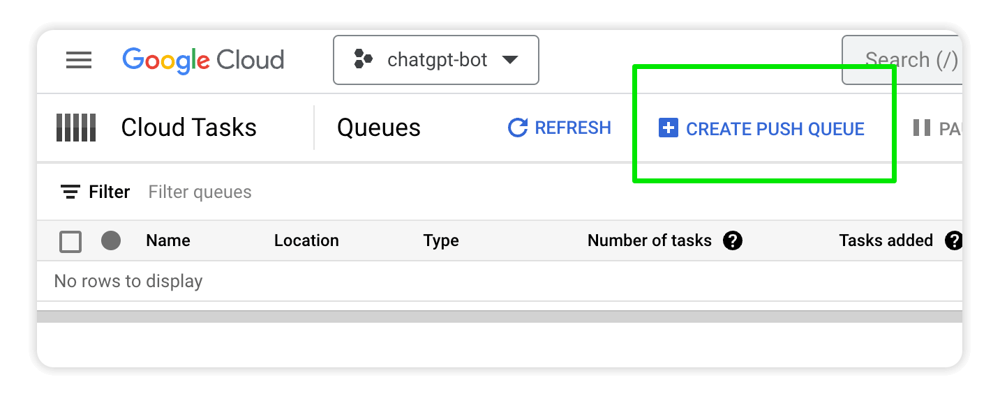

# Module 9 - Interactive Story
It's time to combine all the building blocks you've created for your bot into a new skill! In this module you'll build an interactive "Choose Your Own Adventure" story generator.

## Prerequisites
You can either complete the steps in [Module 8](../mod_8_dialogs#readme) or use the source code from the [Module 8 repo folder](../mod_8_dialogs) as a starting point for completing the steps in this module.

## Steps

### 1. Enable Cloud Tasks API
Go to the [Cloud Tasks API](https://console.cloud.google.com/marketplace/details/google/cloudtasks.googleapis.com) and click the **ENABLE** button.


### 2. Create a Push Queue
Go to [Cloud Tasks](https://console.cloud.google.com/cloudtasks) and create a queue for background tasks by clicking **CREATE PUSH QUEUE**.



Name the queue `story-queue` and select `us-central1` for the region and click **CREATE**.


### 3. Add a slash command
Open the Google Chat API [Configuration tab](https://console.cloud.google.com/apis/api/chat.googleapis.com/hangouts-chat) and scroll to the **Slash commands** section.

Create a new `/story` command by clicking **ADD A NEW SLASH COMMAND**:


Click **DONE** and **SAVE** to apply your changes.

### 4. Add new libraries
Open the `requirements.txt` file and add the four libraries below as a dependencies so you can use them in code. 

```python
# Function dependencies, for example:
# package>=version

functions-framework==3.*
google-cloud-logging==3.0.0
openai==0.27.2
oauth2client==4.1.3
google-cloud-ndb==2.1.1
# >>>>> add the lines below >>>>>>
google-auth==2.17.2
google-api-python-client==2.84.0
google-cloud-tasks==2.13.1
requests==2.28.2
```

### 5. Create a new file called `story_util.py`
Create a new file called `story_util.py` with the following code that takes a story prompt and generates a title, cover image, and chapters with images for each part of the story.

```python
import logging
import google.auth
from apiclient.discovery import build

import gpt_util
import datastore_util

def handle_story_command(thread_id, user_text, message_id_to_update):
    """Handles user prompt for a new story."""

    title_widget = create_story_title(user_text)

    story_prompt = "Write the first section of a story in the style of a "\
        "'choose your own adventure book'. Each section should be 3 "\
        "paragraphs, and then offer 3 choices for the reader to continue. "\
        "The story should be based on the following suggestion: %s" % user_text

    messages = [{"role": "user", "content": story_prompt}]
    chapter_widgets, messages = create_story_chapter(messages)

    datastore_util.store_messages(thread_id, messages, "story")

    all_widgets = [title_widget]
    all_widgets.extend(chapter_widgets)

    cards = {
        "cardsV2": [
            {
                "cardId": "story-card",
                "card": { "sections": [ { "widgets": all_widgets } ] },
            }
        ]
    }

    placeholder_text = "A custom story just for you..."
    update_placeholder_card(thread_id, message_id_to_update, placeholder_text)

    send_asynchronous_chat_message(thread_id, cards)


def create_story_title(user_text):
    """Uses ChatGPT to create title of story based on topic provided."""

    prompt = "The following text was given as the topic of a story. Please "\
        "come up with a witty title for the story. It should be no longer "\
        "than 8 words: %s" % user_text

    story_title = gpt_util.get_gpt_response([{"role": "user", "content": prompt}])

    title_widget = {
        "decoratedText": {
            "text": f"<b>{story_title}</b>",
            "wrapText": True
        }
    }
    
    return title_widget


def create_story_chapter(messages):
    """Creates a card for a story chapter.
    
    Gets new chapter text using provided messages. Generates an image
    related to the new chapter text.
    """

    chapter_text = gpt_util.get_gpt_response(messages)
    chapter_widget = {
        "textParagraph": {
            "text": chapter_text
        }
    }

    # add new response to message history
    messages.append( {"role": "assistant", "content": chapter_text} )

    # make a copy of the messages
    image_messages = messages[:]
    prompt = "Write a prompt with a maximum of 30 words to create an "\
            "illustrated image for this most recent part of the story:\r\n %s" % chapter_text
    
    image_messages.append({"role": "user", "content": prompt})
    image_prompt = gpt_util.get_gpt_response(image_messages)
    image_prompt = f"{image_prompt}. This should be an illustration "\
                    "for a children's book in the style of an acrylic painting."
    logging.info("Story chapter image prompt: %s" % image_prompt )

    image_url = gpt_util.create_image_with_prompt(image_prompt)
    image_widget = {
        "image": {
            "imageUrl": image_url
        }
    }

    widgets = [image_widget, chapter_widget]

    # add The End to bottom if last message of story
    if len(messages) == 10:
        end_widget = {
          "decoratedText": {
            "text": "<b>The End</b>",
            "startIcon": {
              "knownIcon": "BOOKMARK"
            }
          }
        }
        widgets.append(end_widget)

    return widgets, messages


def process_story_message(thread_id, user_text, message_id_to_update):
    """Processes a response from user for the next path of the story."""

    thread_obj = datastore_util.get_thread(thread_id)
    messages = thread_obj.get_messages()

    # wrap up the story after 4 choices
    if len(messages) == 8:
        user_text = "End the story with this option: %s" % user_text

    messages.append({"role": "user", "content": user_text})
    chapter_widgets, messages = create_story_chapter(messages)

    datastore_util.store_messages(thread_id, messages, "story")

    cards = {
        "cardsV2": [
            {
                "cardId": "story-card",
                "card": { "sections": [ { "widgets": chapter_widgets } ] },
            }
        ]
    }

    chapter_number = len(messages) // 2
    placeholder_text = f"Chapter {chapter_number}"
    update_placeholder_card(thread_id, message_id_to_update, placeholder_text)

    send_asynchronous_chat_message(thread_id, cards)


def send_generating_story_card(thread_id):
    """Sends a "Generating..." placeholder card.

    Returns message_id so the message can be updated later.
    """
    body = { "text" : "Generating..."}
    message_id = send_asynchronous_chat_message(thread_id, body)

    return message_id


def update_placeholder_card(thread_id, message_id, content):
    """Updates the "Generating story..." placeholder card with new text."""

    body = { "text" : content }
    send_asynchronous_chat_message(thread_id, body, message_id=message_id)


def send_asynchronous_chat_message(thread_id, body, message_id=None):
    """Send a chat message to a space asynchronously.

    If message_id is provided, it updates the existing message.

    Returns the message_id of the message created or updated.

    This message is NOT a direct response to an incoming message request.
    Uses the Chat REST API. 
    """

    space_id = thread_id.split("-")[1]
    space_name = f"spaces/{space_id}"

    SCOPES = ['https://www.googleapis.com/auth/chat.bot']
    credentials, project = google.auth.default(scopes=SCOPES)
    chat = build('chat', 'v1', credentials=credentials)

    # update content of an existing message
    if message_id:
        response_obj = chat.spaces().messages().update(
            name=message_id,
            updateMask='text',
            body=body
        ).execute()

    # create a new message
    else:
        response_obj = chat.spaces().messages().create(
            parent=space_name,
            body=body
        ).execute()

    return response_obj.get("name")
```

### 6. Create a new file called `task_util.py`
Create a new file called `task_util.py` with the following code that creates tasks to run and process in the background using Google Cloud Tasks.

```python
import logging
import json
from google.cloud import tasks_v2
import openai
import story_util
import auth_util
import datastore_util

# TODO: Update with Google Cloud ProjectID
PROJECT_ID = "XXXXXXX"

# TODO: Update with Cloud Functions Service Account
SERVICE_ACCOUNT_EMAIL = "xxxxxxxxxxxxxxx"

# TODO: Update with Cloud Functions Trigger Url
TRIGGER_URL = "xxxxxxxxxxxxx"


def run_as_background_task(action, thread_id, user_text, message_id_to_update):
    """Creates a task in Google Cloud Tasks for the specified action."""

    tasks_client = tasks_v2.CloudTasksClient()

    payload = {
        "background_task" : True,
        "action" : action,
        "thread_id" : thread_id,
        "user_text" : user_text,
        "message_id_to_update" : message_id_to_update
    }

    logging.info(f"run_as_background_task: {action}")

    # Convert dict to JSON string
    payload = json.dumps(payload)

    LOCATION = "us-central1"
    QUEUE = "story-queue"

    parent = tasks_client.queue_path(PROJECT_ID, LOCATION, QUEUE)

    converted_payload = payload.encode()

    task = {
        "http_request": {
            "http_method": tasks_v2.HttpMethod.POST,
            "url": TRIGGER_URL,
            "headers": {"Content-type": "application/json"},
            "oidc_token": {
                "service_account_email": SERVICE_ACCOUNT_EMAIL,
                "audience": TRIGGER_URL
            },
            "body" : converted_payload
        }
    }

    response = tasks_client.create_task(request={"parent": parent, "task": task})


def process_background_task(request):
    """Processes a request from Google Cloud Tasks.
    
    Verifies request before processing.
    """

    if not auth_util.is_backround_request_valid(request):
        return "Unauthorized request"

    task_data = request.get_json()
    logging.info(f"task_data: {task_data}")

    action = task_data.get("action")
    thread_id = task_data.get("thread_id")
    user_text = task_data.get("user_text")
    message_id_to_update = task_data.get("message_id_to_update")
    space_id = thread_id.split("-")[1]
    space_name = f"spaces/{space_id}"
    user_id = thread_id.split("-")[0]

    # get api_key
    try:
        api_key = datastore_util.get_api_key(user_id)
        openai.api_key = api_key
    except:
        from main import MY_API_KEY
        openai.api_key = MY_API_KEY

    if action == "process_story_message":
        story_util.process_story_message(thread_id, user_text, message_id_to_update)
    
    elif action == "handle_story_command":
        story_util.handle_story_command(thread_id, user_text, message_id_to_update)
    
    return {}
```
### 7. Update placeholders in `task_util.py`
Replace the placeholders at the top of `task_util.py` with their actual values.

```python
PROJECT_ID = "XXXXXXX"
SERVICE_ACCOUNT_EMAIL = "xxxxxxxxxxxxxxx"
TRIGGER_URL = "xxxxxxxxxxxxx"
```


For example...
```python
PROJECT_ID = "chatgpt-bot-384221"
SERVICE_ACCOUNT_EMAIL = "chatgpt-bot-384221@appspot.gserviceaccount.com"
TRIGGER_URL = "https://us-central1-chatgpt-bot-384221.cloudfunctions.net/chatgpt-bot"
```

### 8. Update `auth_util.py`

Import `google.auth`, `requests` and the constants from `task-util`  at the top of `auth_util.py` so you can use them in this file.

```python
import logging
from oauth2client import client
import google.auth # <-- add this line
import requests # <-- add this line
from task_util import SERVICE_ACCOUNT_EMAIL, TRIGGER_URL # <-- add this line
```

Add a new function `is_backround_request_valid()` to the bottom of `auth_util.py`.
This will verify the background requests coming from Google Cloud Tasks.

```python
def is_backround_request_valid(request):
    """Validates a background request from Cloud Tasks."""

    CERTS_PATH = "https://www.googleapis.com/oauth2/v1/certs"
    TASK_ISSUER = "https://accounts.google.com"

    try:
        # Get the token from the Authorization header
        auth_header = request.headers.get('Authorization')
        if not auth_header:
            raise Exception('Authorization header is missing')
        
        token = auth_header.split(' ')[1]

        response = requests.get(CERTS_PATH)
        certs = response.json()

        # Validate the token.
        id_token = google.auth.jwt.decode(token, certs=certs, audience=TRIGGER_URL)

        logging.info(f"background request id_token: {id_token}")

        if id_token and id_token['iss'] == TASK_ISSUER:
            return True
        else:
            return False

    except:
        return False
```

### 9. Update `models.py`
Add a `thread_type` attribute to the Thread entity to track if the bot currently in a story.
```python
class Thread(ndb.Model):
    message_history = ndb.JsonProperty()
    timestamp = ndb.DateTimeProperty(auto_now_add=True)
    thread_type = ndb.StringProperty() # <-- add this line

    def get_messages(self):
        return self.message_history['messages']
```

### 10. Update `datastore_util.py`
Update the `store_messages()` function definition to accept a new optional `thread_type` parameter and store it on the entity. Use the code below to update the function:

```python
def store_messages(thread_id, messages=[], thread_type=""):
    """Stores a list of messages for the thread_id.

    Uses get_or_insert() to ensure only one Thread entity exists per thread_id.
    """

    if not thread_id:
        return

    with datastore_client.context():
        thread = Thread.get_or_insert(thread_id)
        thread.message_history = { "messages" : messages }
        thread.thread_type = thread_type
        thread.put()
```

### 11. Update `main.py`
Import `story_util` and `task_util` at the top of `main.py` so you can use them in this file.
```python
import flask
import functions_framework
import logging
import google.cloud.logging
import openai
from auth_util import is_request_valid
import gpt_util
import datastore_util
import random
import string
import dialog_util
import story_util # <-- add this line
import task_util # <-- add this line
```

Update the first part of `handle_chat()` in `main.py` with the following code:

```python
def handle_chat(request):
    """Handles incoming messages from Google Chat."""

    event_data = request.get_json()
    logging.info("received event_data %s" % event_data)

    # routes background tasks for processing
    if event_data.get("background_task", False):
        return task_util.process_background_task(request)

    # verify request is from Google before doing anything
    if not is_request_valid(request):
        return "Unauthorized request"

    event_type = event_data['type']

    # Bot added
    if event_type == 'ADDED_TO_SPACE':
        ...

```

Update the code in `process_message_event()` to handle the `/story` command:

```python
def process_message_event(event_data):

    ...

    # /image
    elif command_id == 4:
        return handle_image_command(user_text)

    # >>>>>> new code below >>>>>>>>
  
    # /story
    elif command_id == 6:
        message_id_to_update = story_util.send_generating_story_card(thread_id)
        task_util.run_as_background_task("handle_story_command", thread_id, user_text, message_id_to_update)
        return {}

    # >>>>>> new code above >>>>>>>>

    else: 
        return process_chat_message(user_text, thread_id)

```

Update `process_chat_message()` to check the `thread_type` to handle story processing.

```python
def process_chat_message(user_text, thread_id, guidance=None):

    messages = []

    # if guidance provided, starting new conversation 
    if guidance:
        messages.append({"role": "system", "content" : guidance})
    else:
        # otherwise get previous messages, because continuing converation
        thread_obj = datastore_util.get_thread(thread_id)

        if thread_obj:
            messages = thread_obj.get_messages()

            # >>>>>> new code below >>>>>>>>

            if thread_obj.thread_type == "story":
                message_id_to_update = story_util.send_generating_story_card(thread_id)
                task_util.run_as_background_task("process_story_message", thread_id, user_text, message_id_to_update)
                return {}

            # >>>>>> new code above >>>>>>>>
    
    # add new message to list
    messages.append( {"role": "user", "content": user_text} )

    ...
```


<br />

### 12. Deploy the changes
Click **DEPLOY** to set your changes live.


## Test the bot
Type `/story` and provide a topic for the story.


Choose an option for what should happen next and watch the story unfold!


## Next Steps
Congratulations! You've finished the project and have a fairly sophisticated bot to show off to others!

You probably already have many ideas about what you want to build next. Here are a few suggestions on where you could take things:

- Add more bot commands for specialized ChatGPT prompts that will streamline your work
- Integrate APIs from other products to give your bot even more power
- Build a different bot for Google Chat that has nothing to do with ChatGPT
- Build a different product powered by ChatGPT that has nothing to do with Google Chat


<br />

## Workshop Feedback
Let me know what you thought of this workshop!

Please [fill out the Workshop Feedback Survey](https://forms.gle/u3zye3iRwraNZpur9) - it's only 3 questions!

<br />

## Sponsor

This code lab was built by the makers of GQueues.

<a href="https://www.gqueues.com">

    </a>

### Prioritize your team’s work with a task manager that helps you get more out of Google Workspace.

<br />
<br />