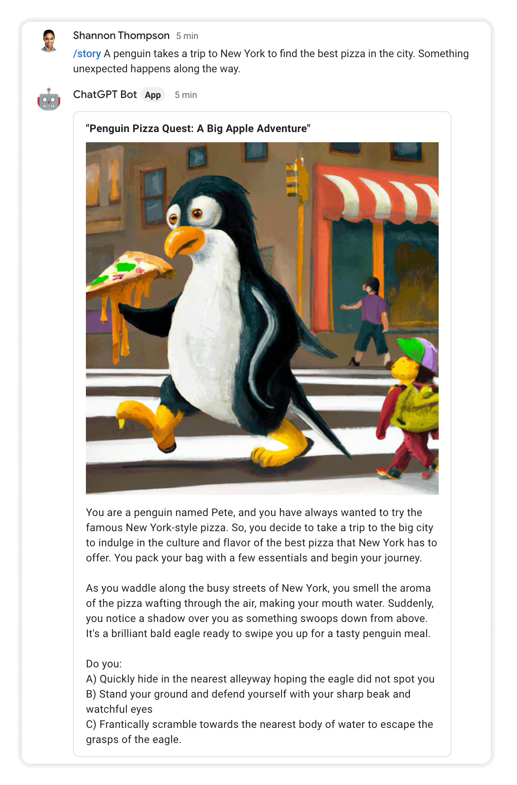

# Module 9 - Interactive Story
It's time to combine all the building blocks you've created for your bot into a new skill! In this module you'll build an interactive "Choose Your Own Adventure" story generator.

## Prerequisites
You can either complete the steps in [Module 8](../mod_8_dialogs#readme) or use the source code from the [Module 8 repo folder](../mod_8_dialogs) as a starting point for completing the steps in this module.

## Steps

### 1. Add a slash command
Open the Google Chat API [Configuration tab](https://console.cloud.google.com/apis/api/chat.googleapis.com/hangouts-chat) and scroll to the **Slash commands** section.

Create a new `/story` command by clicking **ADD A NEW SLASH COMMAND**:


Click **DONE** and **SAVE** to apply your changes.

### 2. Create a new file called `story_util.py`
Create a new file called `story_util.py` with the following code that takes a story prompt and generates a title, cover image, and chapters with images for each part of the story.

```python
import gpt_util
import datastore_util
import logging

def handle_story_command(user_text, thread_id):
    """Handles user prompt for a new story."""

    title_widget = create_story_title(user_text)

    story_prompt = "Write the first section of a story in the style of a "\
        "'choose your own adventure book'. Each section should be 3 "\
        "paragraphs, and then offer 3 choices for the reader to continue. "\
        "The story should be based on the following suggestion: %s" % user_text

    messages = [{"role": "user", "content": story_prompt}]
    chapter_widgets, messages = create_story_chapter(messages)

    datastore_util.store_messages(thread_id, messages, "story")

    all_widgets = [title_widget]
    all_widgets.extend(chapter_widgets)

    cards = {
        "cardsV2": [
            {
                "cardId": "story-card",
                "card": { "sections": [ { "widgets": all_widgets } ] },
            }
        ]
    }

    return cards

def create_story_title(user_text):
    """Uses ChatGPT to create title of story based on topic provided."""

    prompt = "The following text was given as the topic of a story. Please "\
        "come up with a witty title for the story. It should be no longer "\
        "than 8 words: %s" % user_text

    story_title = gpt_util.get_gpt_response([{"role": "user", "content": prompt}])

    title_widget = {
        "decoratedText": {
            "text": f"<b>{story_title}</b>",
            "wrapText": True
        }
    }
    
    return title_widget


def create_story_chapter(messages):
    """Creates a card for a story chapter.
    
    Gets new chapter text using provided messages. Generates an image
    related to the new chapter text.
    """

    chapter_text = gpt_util.get_gpt_response(messages)
    chapter_widget = {
        "textParagraph": {
            "text": chapter_text
        }
    }

    # add new response to message history
    messages.append( {"role": "assistant", "content": chapter_text} )

    # make a copy of the messages
    image_messages = messages[:]
    prompt = "Write a prompt with a maximum of 30 words to create an "\
            "illustrated image for this most recent part of the story:\r\n %s" % chapter_text
    
    image_messages.append({"role": "user", "content": prompt})
    image_prompt = gpt_util.get_gpt_response(image_messages)
    image_prompt = f"{image_prompt}. This should be an illustration "\
                    "for a children's book in the style of an acrylic painting."
    logging.info("Story chapter image prompt: %s" % image_prompt )

    image_url = gpt_util.create_image_with_prompt(image_prompt)
    image_widget = {
        "image": {
            "imageUrl": image_url
        }
    }

    widgets = [image_widget, chapter_widget]

    # add The End to bottom if last message of story
    if len(messages) == 10:
        end_widget = {
          "decoratedText": {
            "text": "<b>The End</b>",
            "startIcon": {
              "knownIcon": "BOOKMARK"
            }
          }
        }
        widgets.append(end_widget)

    return widgets, messages


def process_story_message(thread_id, user_text, messages):
    """Processes a response from user for the next path of the story."""

    # wrap up the story after 4 choices
    if len(messages) == 8:
        user_text = "End the story with this option: %s" % user_text

    messages.append({"role": "user", "content": user_text})
    chapter_widgets, messages = create_story_chapter(messages)

    datastore_util.store_messages(thread_id, messages, "story")

    cards = {
        "cardsV2": [
            {
                "cardId": "story-card",
                "card": { "sections": [ { "widgets": chapter_widgets } ] },
            }
        ]
    }

    return cards
```

### 3. Update `models.py`
Add a `thread_type` attribute to the Thread entity to track if the bot currently in a story.
```python
class Thread(ndb.Model):
    message_history = ndb.JsonProperty()
    timestamp = ndb.DateTimeProperty(auto_now_add=True)
    thread_type = ndb.StringProperty() # <-- add this line

    def get_messages(self):
        return self.message_history['messages']
```

### 4. Update `datastore_util.py`
Update the `store_messages()` function definition to accept a new optional `thread_type` parameter and store it on the entity. Use the code below to update the function:

```python
def store_messages(thread_id, messages=[], thread_type=""):
    """Stores a list of messages for the thread_id.

    Uses get_or_insert() to ensure only one Thread entity exists per thread_id.
    """

    if not thread_id:
        return

    with datastore_client.context():
        thread = Thread.get_or_insert(thread_id)
        thread.message_history = { "messages" : messages }
        thread.thread_type = thread_type
        thread.put()
```

### 5. Update `main.py`
Import `story_util` at the top of `main.py` so you can use it in this file.
```python
import flask
import functions_framework
import logging
import google.cloud.logging
import openai
from auth_util import is_request_valid
import gpt_util
import datastore_util
import random
import string
import dialog_util
import story_util # <-- add this line
```

Update the code in `process_message_event()` to handle the `/story` command:
```python
def process_message_event(event_data):

    ...

    # /image
    elif command_id == 4:
        return handle_image_command(user_text)

    # >>>>>> new code below >>>>>>>>
  
    # /story
    elif command_id == 6:
        return story_util.handle_story_command(user_text, thread_id)

    # >>>>>> new code above >>>>>>>>

    else: 
        return process_chat_message(user_text, thread_id)

```

Update `process_chat_message()` to check the `thread_type` to handle story processing.
```python
def process_chat_message(user_text, thread_id, guidance=None):

    messages = []

    # if guidance provided, starting new conversation 
    if guidance:
        messages.append({"role": "system", "content" : guidance})
    else:
        # otherwise get previous messages, because continuing converation
        thread_obj = datastore_util.get_thread(thread_id)

        if thread_obj:
            messages = thread_obj.get_messages()

            # >>>>>> new code below >>>>>>>>

            if thread_obj.thread_type == "story":
                return story_util.process_story_message(thread_id, user_text, messages)

            # >>>>>> new code above >>>>>>>>
    
    # add new message to list
    messages.append( {"role": "user", "content": user_text} )

    ...
```

<br />

### 6. Deploy the changes
Click **DEPLOY** to set your changes live.


## Test the bot
Type `/story` and provide a topic for the story.




Choose an option for what should happen next and watch the story unfold!


## Next Steps
Congratulations! You've finished the project and have a fairly sophisticated bot to show off to others!

You probably already have many ideas about what you want to build next. Here are a few suggestions on where you could take things:

- Add more bot commands for specialized ChatGPT prompts that will streamline your work
- Integrate APIs from other products to give your bot even more power
- Build a different bot for Google Chat that has nothing to do with ChatGPT
- Build a different product powered by ChatGPT that has nothing to do with Google Chat


<br />

## Workshop Feedback
Let me know what you thought of this workshop!

Please [fill out the Workshop Feedback Survey](https://forms.gle/u3zye3iRwraNZpur9) - it's only 3 questions!

<br />

## Sponsor

This code lab was built by the makers of GQueues.

<a href="https://www.gqueues.com">

    </a>

### Prioritize your team’s work with a task manager that helps you get more out of Google Workspace.

<br />
<br />